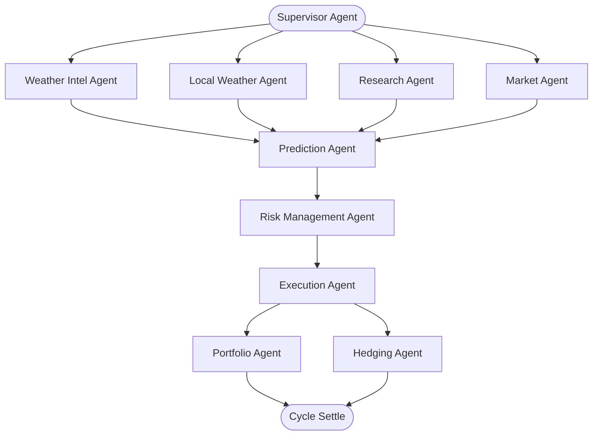

# ⛈️ Weather Prediction AI Trading Agent Terminal

A complete, production-grade, autonomous multi-agent quantitative trading system that predicts weather outcome markets on Polymarket and executes profitable paper trades under strict capital risk controls.

The system acts as a combination of a **Bloomberg Terminal**, **OpenAI Deep Research**, a **Quantitative Trading Engine**, and a **Weather Intelligence Platform**.

---

## 🏗️ System Architecture

The terminal is built with a highly decoupled, modular multi-agent structure orchestrated by a **Supervisor Agent** (Agent 10). It employs 9 other specialized agents, each managing a single, isolated domain.



### 🤖 The 10 Specialized Agents

1. **Weather Intelligence Agent (Agent 1):** Fetches and parses global 10-day forecasts from Open-Meteo.
2. **Local Weather Research Agent (Agent 2):** Collects official country-specific alerts and warnings (NOAA for US, Met Office for UK, etc.).
3. **Market Agent (Agent 3):** Monitors Polymarket contract order books, YES/NO prices, volumes, spreads, and market implied probabilities.
4. **Research Agent (Agent 4):** Conducts web and social media news research (via DuckDuckGo) to identify climate anomalies and market sentiment.
5. **Prediction Agent (Agent 5):** Evaluates quantitative forecasts, climatological priors, and news sentiment using a calibrated prediction model to estimate edge and fair odds.
6. **Risk Management Agent (Agent 6):** Enforces fractional Kelly sizing, daily drawdown halts, and Value-at-Risk (VaR) compliance.
7. **Execution Agent (Agent 7):** Executes paper trades with market-impact slippage models and commits trades to the SQLite database.
8. **Portfolio Agent (Agent 8):** Tracks valuation metrics and computes annualized Sharpe and Sortino ratios.
9. **Hedging Agent (Agent 9):** Identifies exposure risk concentrations and automatically executes offsetting city-weather correlation hedges.
10. **Supervisor Agent (Agent 10):** Orchestrates the full loop, seeds cities, schedules executions, and processes payouts for expired contracts.

---

## 🛠️ Technology Stack

- **Language:** Python 3.12+
- **Agent Orchestration:** Hermes Agent Framework & OpenRouter (Gemini / GPT models)
- **Data Clients:** DuckDuckGo Web Search, Open-Meteo, NOAA API
- **Quantitative Engine:** Scikit-Learn, Pandas, NumPy, Plotly
- **Database:** SQLite & SQLAlchemy (Asyncio)
- **Frontend Dashboard:** Streamlit
- **Backend API:** FastAPI & Uvicorn
- **Containerization:** Docker & Docker Compose

---

## 🚀 Quick Start Guide

### 1. Installation & Environment Setup
Clone the repository and initialize the Python virtual environment:
```bash
# Create virtual environment
uv venv --python 3.12
source .venv/bin/activate

# Install dependencies
uv pip install -r requirements.txt
uv pip install git+https://github.com/NousResearch/hermes-agent.git
```

Create a `.env` file in the root directory (based on `.env.example`):
```env
OPENROUTER_API_KEY=your_openrouter_api_key
LLM_MODEL=google/gemini-2.5-flash
STARTING_BALANCE=10000.0
KELLY_FRACTION=0.25
```

### 2. Run the Command-Line Demo
Execute a complete workflow cycle (seeding, prediction, risk sizing, trade placement, portfolio valuation) with a detailed terminal audit report:
```bash
PYTHONPATH=. uv run python scripts/run_demo.py
```

### 3. Launch the Professional Web Dashboard
Start the FastAPI backend server:
```bash
PYTHONPATH=. uv run python app/main.py
```

In a separate terminal, start the Streamlit UI terminal:
```bash
uv run streamlit run app/dashboard/app.py
```
Open your browser at `http://localhost:8501` to access the trading terminal.

---

## 🐳 Docker Deployment
To launch the entire platform (FastAPI + Streamlit Dashboard) in isolated containers:
```bash
docker-compose up --build
```
- **Web Terminal:** `http://localhost:8501`
- **FastAPI Documentation:** `http://localhost:8000/docs`

---

## 🧪 Running Tests
Verify the mathematical formulas, data parsers, and execution layers:
```bash
PYTHONPATH=. uv run pytest tests/
```
