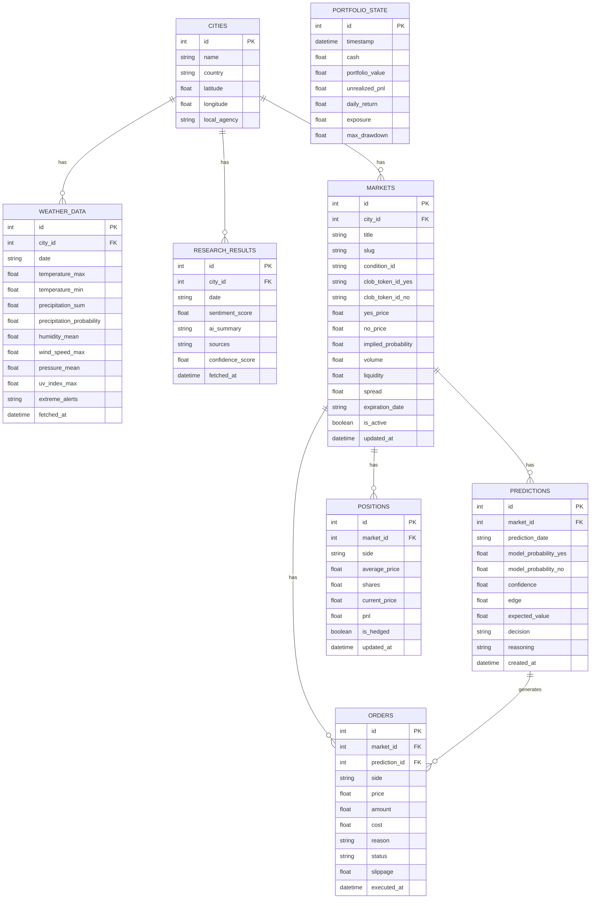

# Database Schema Documentation

The Weather Prediction AI Trading Agent stores all forecasts, market prices, predictions, trades, and portfolio history in a local SQLite database managed by SQLAlchemy async ORM.

---

## 📊 Entity Relationship Diagram

---

## 🗂️ Core Tables Description

### 1. `cities`
Stores coordinates, names, and regional offices for the 20 supported target weather centers.

### 2. `weather_data`
Logs daily forecast parameters and precipitation probabilities.

### 3. `research_results`
Stores news sentiment, summaries, and source URLs scraped by Agent 4.

### 4. `markets`
Tracks active Polymarket weather contracts, YES/NO prices, book spreads, and volumes.

### 5. `predictions`
Stores calibrated YES/NO probabilities, calculated edge, and EV generated by Agent 5.

### 6. `orders`
Stores transaction details (slippage, cost, size, execution status) placed by Agent 7.

### 7. `positions`
Tracks active holdings (average cost basis, current price, net PnL) in the portfolio.

### 8. `portfolio_state`
A historical time-series of the portfolio value, cash, and drawdown metrics, used to plot the equity curve.
